## Item
- create Item(e: cube) name it "Item"
- create emptyObject name it "collider" add collider
- add rigibody to item
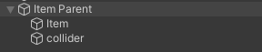

## Crosshair
- create canvas
- right click canvas, choose UI->image
- click image, change width * height = 10*10
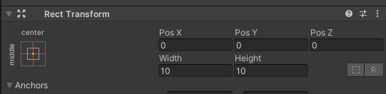

## Player
- create emptyObject in player's hand as child name it "pick"
- tag: "Player"

## Script
- create PickupTrigger.cs
- create CrosshairAim.cs
- create PlayerTrigger.cs

## Shader Graph
- create lit shader rename it to "BorderGraph"
- create Material rename it to "BorderMaterial"
- add TriggerValue, BaseColor & BorderColor

Note: this ain't border, this is just for crosshair testing
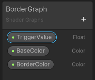
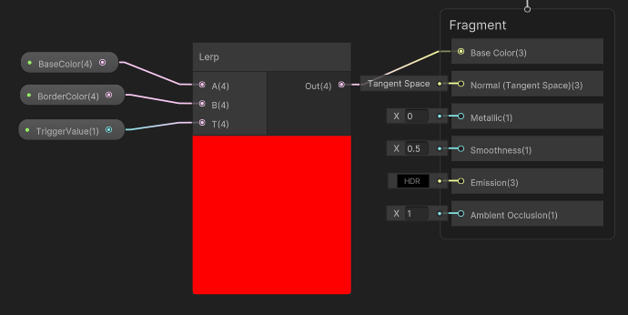

## Attach
### Item
- drag BorderMaterial to Item
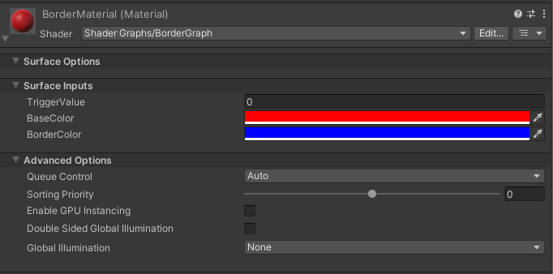

### Player
- drag "PickupTrigger.cs" to Player
- assign "Hand" from player's hand (emptyObject name: "pick")
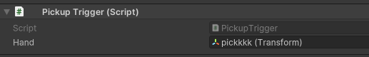

### Camera
- drag "CrosshairAim.cs" to Camera
- Crosshair -> from canvas>crosshair(image)
- Camera -> camera
- Item Layer -> Item
- Mat -> BorderMaterial
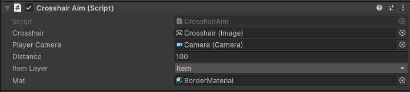

note: "PlayerTrigger.cs" is un-attachable

## Goals
If the player is inside the collider and not aiming, the color won’t change & cannot pick the item
or
If the player is outside the collider and aiming, the color won’t change & cannot pick the item
Player -> inside collider && aiming the item ? color changed & pick Item by pressing "E" : color won’t change 
- 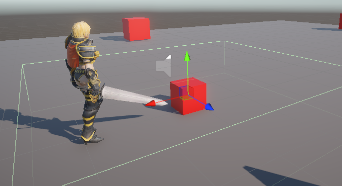
- 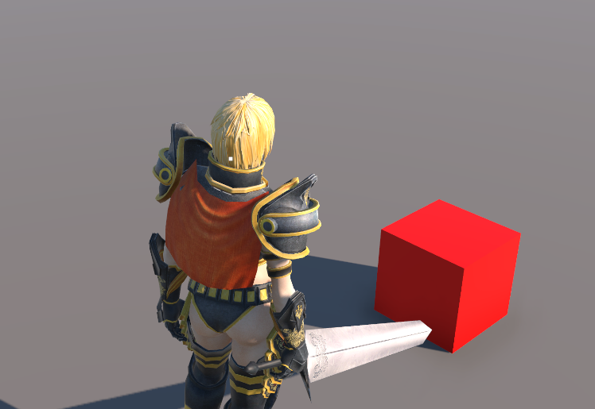
- 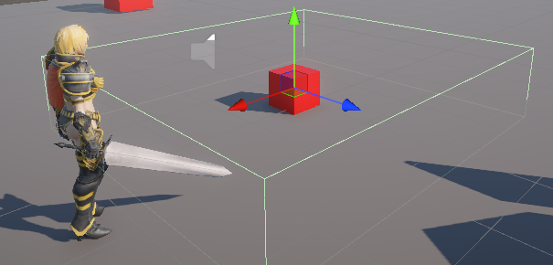
- 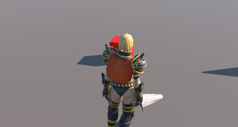
- 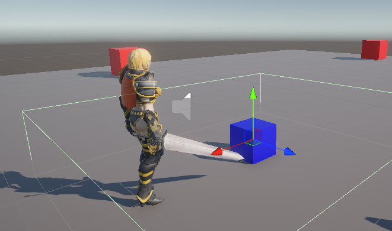
- 
- 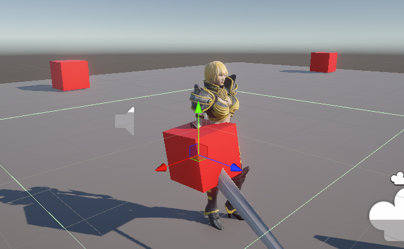