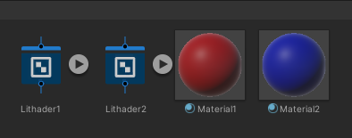
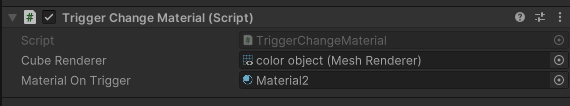
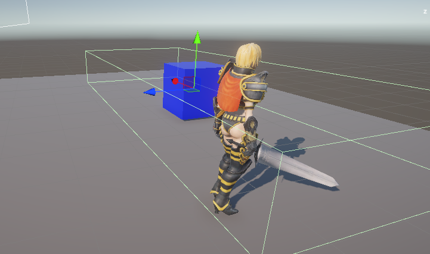

## object & collider
- create object (ex: cube) name it "color object"
- create emptyObject (as collider) name it "collider"

## material
- create material1 & material2
- create litShader1 & litShader2
- drag litShader1 into material1 (red)
- drag litShader2 into material2 (blue)

## assign
- attach material1 to color object
- attach script to collider 
- drag color object into collider script(Object Render input)
- drag material2 into script script(Material input)

## player
- tag == "Player" -> collider in = blue
- tag == "Player" -> collider out = red (originalMaterial)

