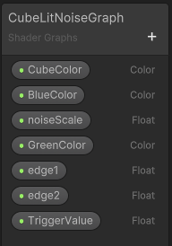
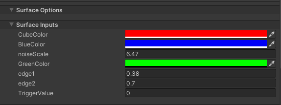
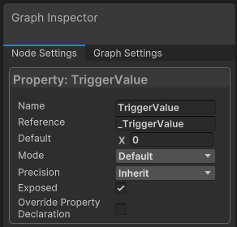
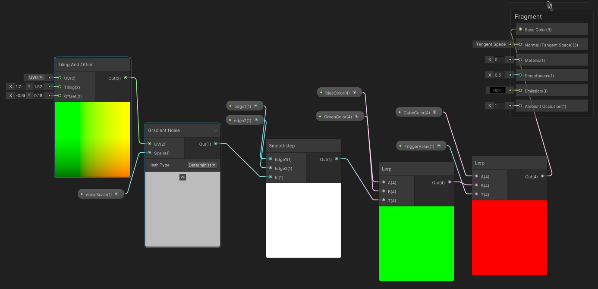
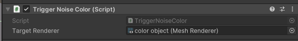
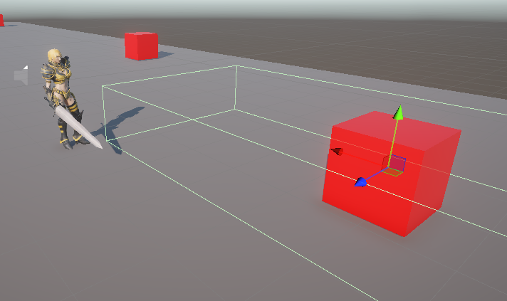
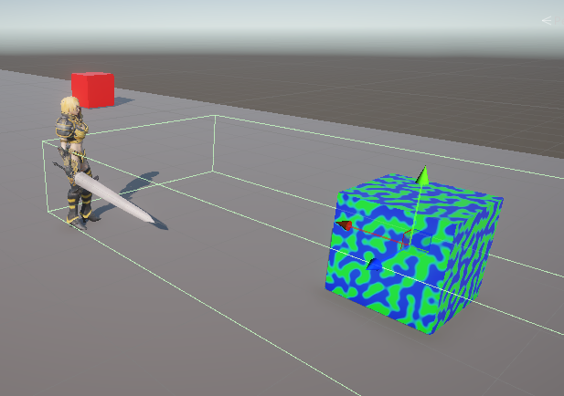

## object & collider
- create object (ex: cube) name it "color object"
- create emptyObject (as collider) name it "collider"

## material
- create CubeMaterial
- create CubeLitNoise
- drag CubeLitNoise into CubeMaterial

## Lit Shader
- in Shader Graph (Blackboard), press + (plus button)
- create CubeColor (type color)
- create BlueColor, GreenColor (type color) etc..

### Cube Color
- click Cube Color, in Graph Inspector click exposed (true)
- in graph inspector (Name: CubeColor, Reference: _CubeColor, Default: red)

### Trigger Value
- click Cube Color, in Graph Inspector click exposed (true)
- in graph inspector (Name: TriggerValue, Reference: _TriggerValue, Default x: 0)

## Lit Shader Graph
- Tilling & Offset to Gradient Noise (UV)
- noiseScale to Gradient Noise (Scale)
- Gradient Noise (out) to Smoothstep (In)
- edge1 to Smoothstep (Edge1)
- edge2 to Smoothstep (Edge2)
- Smoothstep (out) to Lerp1 (T)
- BlueColor to Lerp1 (A)
- GreenColor to Lerp1 (B)
- Lerp1 (out) to Lerp2 (B)
- CubeColor to Lerp(2) A
- TriggerValue to Lerp2 (T)
- Lerp2 (out) to Base Color

## assign
- attach CubeMaterial to color object
- attach script to collider
- drag color object into collider script(Object Render input)

## player
- tag == "Player" -> collider in = TriggerValue(1f)
- tag == "Player" -> collider out = triggerValue(0f)

